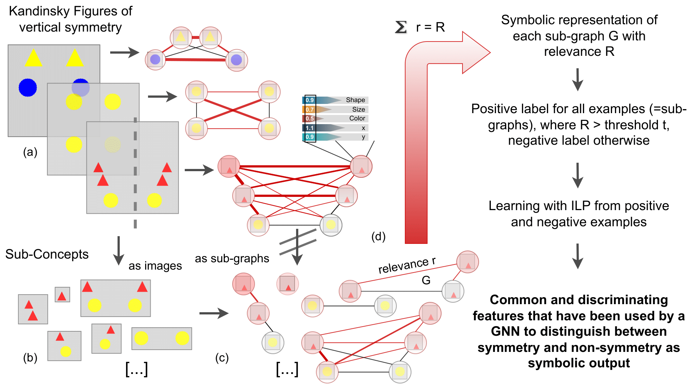

# HuCE---Human-centered-Explanations



## Usage and examples:

To create all x-axis relations, run the file:

```
python concepts_kandinsky/concept_x_axis_relations.py
```

## Folders:

- **concepts_kandinsky**
  - all_possible_graphs_generator.py: Generates all possible graphs with 2, 3, 4, nodes with                                       variable number of edges - 
                                      once symmetric once non-symmetric 
  - concept_single_object.py: Generates all possible graphs and Prolog output for the single                               object concept
  - concept_x_axis_relations.py: Generates all possible graphs and Prolog output for the
                                 x-axis relations concept
  - concept_y_axis_relations.py: Generates all possible graphs and Prolog output for the
                                 y-axis relations concept
  - concept_alignment_relations.py: Generates all possible graphs and Prolog output for the
                                    alignment relations concept (left of, right of, ...)
- **data**
  - input_data: Any data that can be used as input to further processing
                This folder contains some images of the symmetric Kandinsky Pattern
                "true", "false" and "counterfactual" subfolders have images for each case
  - output_data: All data produced by our code. It contains images of the generated graphs
                 and Prolog output
- **docs**: Documentation items like figures
- **graph_generators**: Functions that deal with the generation of graphs with particular 
                    properties, such as fully-connected
- **plots**: Plotting functions
- **test_cases**: Test-cases for the generated Prolog output. Most of them are checks of the
              form "if an object is left of another" then by consistency the opposite 
              relation "right of" incorporating those objects should be present in the
              generated Prolog file
- **utils**: Utility functions

## Contact:

- Anna Saranti: [anna.saranti@boku.ac.at](mailto:anna.saranti@boku.ac.at)

